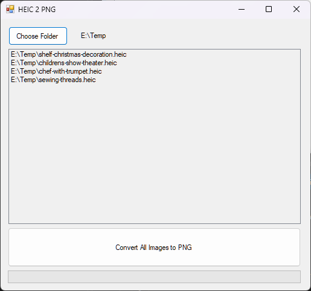

# HEIC_2_PNG
Bulk convert all HEIC files in a folder to PNG using ImageMagick.NET

Given a folder path, the program finds all HEIC files in the folder which do not already have PNG files of the same name. These HEIC files are shown in a list view.

Pressing the convert button will then convert each of the HEIC files listed to PNG and save the results back to the same folder.

Please note that this program deletes the original HEIC files if the conversion to PNG was a success.

Written in .NET using ImageMagick for .NET [Magick.NET](https://github.com/dlemstra/Magick.NET)

